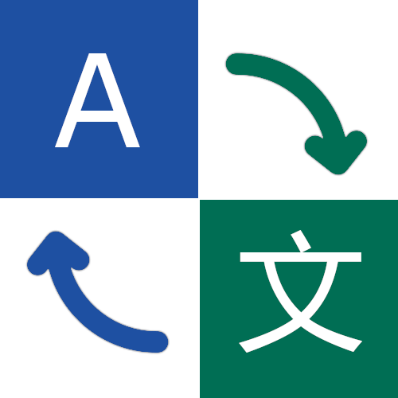

# Youdao Translation Plugin (FlowLauncher)

 

English | [Chinese](docs/README_CN.md)

## Overview

This plugin allows you to quickly translate text from within Flow Launcher. It supports automatic language detection, configurable source and target languages, and integrates with your clipboard for fast copying of results.

## Notes

- This plugin currently works **only with the Youdao Open API**.  
- Non-API translation modes (web-based or offline) are **not yet implemented**, but may be added in the future.  
- First-time users should review Youdao’s pricing, as API usage may require a paid plan.  
- Apply for API: **[Youdao Open Platform](https://ai.youdao.com)**

## Features

- Real-time translation using Youdao API
- Automatic language detection
- Copy translation to clipboard with one key press

## Installation

1. **Download the plugin ZIP**  
   Go to the GitHub repository [Releases](https://github.com/Prslc/Flow.translate-youdao/releases) and download the latest ZIP file.

2. **Install to Flow Launcher**  
   - Open Flow Launcher **Settings**  
   - Click **Plugin Store**  
   - Select **Install plugin from local**  
   - Choose the downloaded ZIP file  
   - **Restart Flow Launcher**

3. **Set your Youdao API credentials**  
   Configure `app_token` and `app_secret` in the plugin settings.

4. **Select source and target languages**  
   Use the dropdown menus to choose your source language and target language.

## Usage

- Launch the Flow Launcher input box, type the plugin keyword **`tr`**, then enter the text you want to translate.  
- Press **Enter** to copy the translated text to your clipboard.

## Roadmap

- [ ] Non-API translation mode (web or offline)  
- [ ] Multilingual localization support  
- [ ] Save Mode (reduce token usage costs)

## Credit

- **[FlowLauncher](https://github.com/Flow-Launcher/Flow.Launcher)** – The core launcher platform that this plugin runs on and integrates with.  
- **[pyFlowLauncher](https://github.com/Garulf/pyFlowLauncher)** – A Python framework for building Flow Launcher plugins, used as the main plugin API.  
- **[Flow.Launcher.Plugin.DirectTranslate](https://github.com/Drimix20/Flow.Launcher.Plugin.DirectTranslate)** – Provided inspiration for plugin architecture, UX behavior, and translation workflow.
- **[Wox.Plugin.Youdao](https://github.com/pengzhxyz/Wox.Plugin.Youdao)** – Original plugin for Wox, which served as a reference for features, workflow, and overall concept.